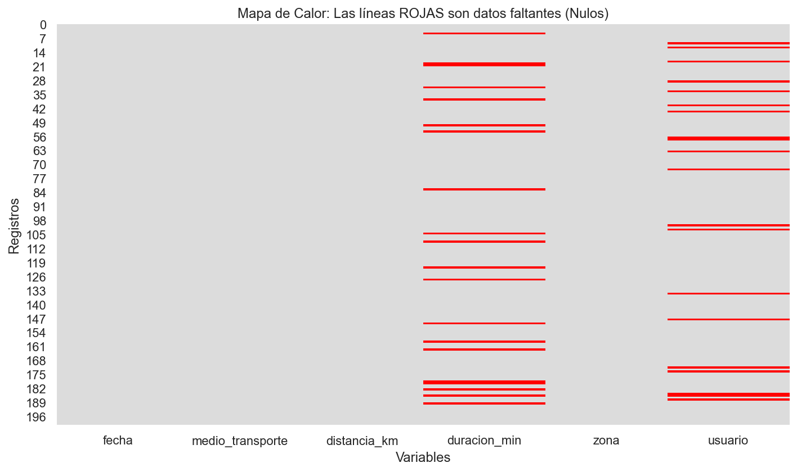
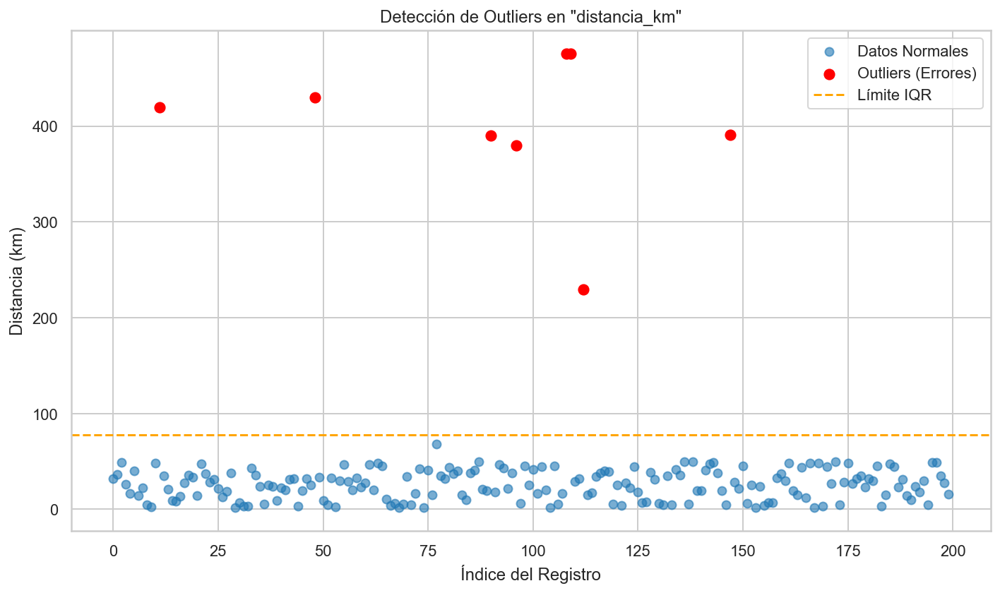

# Urban Mobility Data Pipeline: Generation, Cleaning & EDA


## Project Overview
This project simulates a real-world data engineering scenario focused on **Urban Mobility Analysis**. The goal was to build a robust pipeline that generates synthetic data, simulates common data quality issues (missing values and outliers), and applies statistical techniques to clean the dataset for future Machine Learning integration.

This repository demonstrates the end-to-end process of **Data Wrangling** and **Exploratory Data Analysis (EDA)**.

## Tech Stack
*   **Python**: Core logic.
*   **Pandas & NumPy**: Data manipulation and synthetic generation.
*   **Seaborn & Matplotlib**: Visualization of null matrices and scatter plots.

## Key Features

### 1. Synthetic Data Generation
Created a realistic dataset (`movilidad_urbana.csv`) representing 200 records of urban transport usage.
*   **Variables:** Date, Transport Mode (Bus, Metro, etc.), Distance (km), Duration (min), Zone, and User ID.
*   **Reproducibility:** Used `np.random.seed(42)` to ensure consistent results.

### 2. Handling Missing Data (Nulls)
Simulated system failures by injecting null values into `duration_min` and `user_id`.
*   **Detection:** Visualized missing patterns using Heatmaps.
*   **Strategy:** 
    *   **Numerical:** Imputed using the **Median** (robust against outliers).
    *   **Categorical:** Imputed using the **Mode** (most frequent value).

### 3. Outlier Management
Simulated measurement errors (GPS glitches) in the `distance_km` variable.
*   **Detection:** Applied the **Interquartile Range (IQR)** method.
    *   *Lower Limit:* Q1 - 1.5 * IQR
    *   *Upper Limit:* Q3 + 1.5 * IQR
*   **Treatment:** Applied **Clipping (Capping)** to constrain extreme values within statistically acceptable margins without deleting data.

## Visualizations

Here is a visual representation of the data quality issues detected and fixed during the process.

### 1. Missing Data Detection
The red lines indicate missing values (Nulls) injected into the dataset. The randomness of the distribution confirms there is no structural bias in the missing data.



### 2. Outlier Analysis
Using the IQR method, we identified extreme values in `distance_km`. The red points represent data that falls outside the statistical thresholds and was subsequently clipped.



## How to Run

1.  Clone the repository:
    ```bash
    git clone https://github.com/DanielVegaRosado/urban-mobility-data-cleaning.git
    ```
2.  Install dependencies:
    ```bash
    pip install pandas numpy matplotlib seaborn
    ```
3.  Run the script:
    ```bash
    python main.py
    ```

## Results
The final output is a clean CSV file ready for ML modeling, with no missing values and normalized distribution of distances.

---

*Author: Daniel Vega Rosado | Computer Engineering Student*
